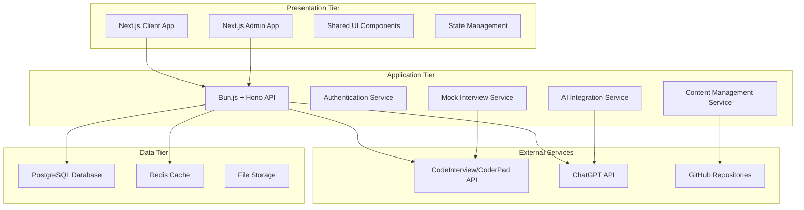
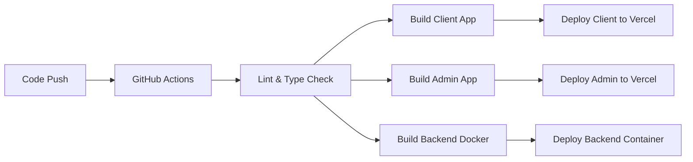
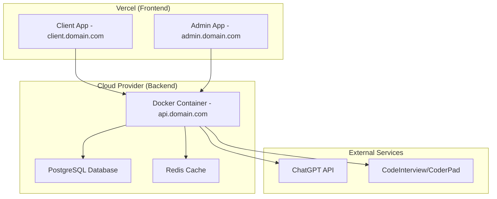

# Design Document

## Overview

The Tech Interview Preparation Platform will be built as a modern, scalable web application using a three-tier architecture. The system will provide role-specific learning roadmaps, a comprehensive question bank, and interactive mock interviews through a Next.js frontend with separate client and admin applications, a Bun.js API backend, and a robust data storage layer with caching.

## Architecture

### High-Level Architecture

The platform follows a three-tier architecture pattern with separate client and admin frontends:



### Technology Stack

**Frontend (Client & Admin):**
- Next.js 14 with App Router for SSR/SSG capabilities
- TypeScript for type safety and better developer experience
- Tailwind CSS for utility-first styling and responsive design
- Shadcn/ui + Radix UI for accessible, customizable components
- React Query (TanStack Query) for server state management
- Axios for API communication
- Atomic Design pattern for component organization

**Backend:**
- Bun.js runtime with Hono framework for high performance
- TypeScript for type safety across the stack
- JWT for stateless authentication (admin only)
- Built-in security features and rate limiting
- Drizzle ORM for type-safe database operations

**Database:**
- PostgreSQL as primary database for structured data
- Redis for caching frequently accessed content
- Database migrations with Drizzle Kit

**Infrastructure:**
- Frontend: Vercel deployment with automatic CI/CD
- Backend: Docker containers deployable to any cloud provider
- GitHub Actions for CI/CD pipeline integration

## Components and Interfaces

### Frontend Architecture

#### Project Structure (Based on React App Structure)
```
apps/
├── client/                    # Next.js Client Application
│   ├── src/
│   │   ├── app/              # Next.js App Router
│   │   │   ├── layout.tsx    # Root layout
│   │   │   ├── page.tsx      # Home page
│   │   │   ├── roadmaps/     # Roadmap pages
│   │   │   ├── questions/    # Question bank pages
│   │   │   └── mock-interviews/ # Mock interview pages
│   │   ├── components/       # UI Components (Atomic Design)
│   │   │   ├── atoms/        # Button, Input, Label
│   │   │   ├── molecules/    # SearchBar, QuestionCard
│   │   │   ├── organisms/    # Header, QuestionList, RoadmapViewer
│   │   │   └── templates/    # PageLayout, AuthLayout
│   │   ├── lib/              # Business logic and utilities
│   │   │   ├── constants/    # Global constants
│   │   │   ├── helpers/      # Utility functions
│   │   │   ├── hooks/        # Custom reusable hooks
│   │   │   ├── store/        # State management (Zustand)
│   │   │   └── types/        # Shared TypeScript types
│   │   ├── services/         # API services
│   │   │   ├── roadmaps/     # Roadmap API services
│   │   │   ├── questions/    # Question API services
│   │   │   └── mock-interviews/ # Mock interview services
│   │   └── styles/           # Global styles
│   └── package.json
│
├── admin/                     # Next.js Admin Application
│   ├── src/
│   │   ├── app/              # Admin App Router
│   │   │   ├── layout.tsx    # Admin layout
│   │   │   ├── page.tsx      # Admin dashboard
│   │   │   ├── content/      # Content management
│   │   │   └── users/        # User management
│   │   ├── components/       # Admin-specific components
│   │   ├── lib/              # Admin utilities
│   │   └── services/         # Admin API services
│   └── package.json
│
└── shared/                    # Shared packages
    ├── ui/                   # Shared UI components
    ├── types/                # Shared TypeScript types
    └── utils/                # Shared utilities
```

#### Core UI Components

**Client Application:**
- **Header/Navigation**: Main navigation with role selection and search
- **RoadmapViewer**: Interactive timeline visualization for learning paths
- **QuestionBank**: Searchable, filterable question interface
- **MockInterview**: Integrated coding environment with timer and feedback

**Admin Application:**
- **AdminDashboard**: Overview of platform metrics and content
- **ContentManager**: Interface for managing questions and roadmaps
- **UserManager**: User activity and contribution management
- **AnalyticsDashboard**: Platform usage and performance metrics

#### State Management
- **Client App**: Zustand for global state (user preferences, progress tracking)
- **Admin App**: Zustand for admin state (content management, user sessions)
- **Server State**: React Query for API data caching and synchronization
- **Local Storage**: Progress tracking and user preferences persistence

## UI Design and Component Library

### Recommended UI Library: Shadcn/ui + Radix UI

**Why Shadcn/ui?**
- Copy-paste components (not a dependency) - perfect for customization
- Built on Radix UI primitives for accessibility
- Tailwind CSS integration
- TypeScript support
- Consistent design system
- Easy to customize and extend

### Client Application UI Design

#### Home Page Layout
```
┌─────────────────────────────────────────────────────────────┐
│ Header: Logo | Roadmaps | Questions | Mock Interviews | 🔍  │
├─────────────────────────────────────────────────────────────┤
│                                                             │
│  🎯 Tech Interview Preparation Platform                     │
│     Master your next tech interview                        │
│                                                             │
│  ┌─────────────┐ ┌─────────────┐ ┌─────────────┐          │
│  │ 🗺️ Roadmaps │ │ ❓ Questions │ │ 🎤 Mock     │          │
│  │             │ │             │ │   Interview │          │
│  │ Role-based  │ │ 10k+ Curated│ │             │          │
│  │ Learning    │ │ Questions   │ │ AI-Powered  │          │
│  └─────────────┘ └─────────────┘ └─────────────┘          │
│                                                             │
│  Popular Roles:                                            │
│  [Frontend] [Backend] [Full-Stack] [DevOps] [Mobile]      │
│                                                             │
└─────────────────────────────────────────────────────────────┘
```

#### Roadmap Viewer Page
```
┌─────────────────────────────────────────────────────────────┐
│ Header + Breadcrumb: Home > Roadmaps > Senior Frontend     │
├─────────────────────────────────────────────────────────────┤
│                                                             │
│ 🎯 Senior Frontend Developer Roadmap                       │
│ ⏱️ Estimated: 40 hours | 📊 Progress: 30%                  │
│                                                             │
│ ┌─ Timeline View ─────────────────────────────────────────┐ │
│ │                                                         │ │
│ │ ✅ 1. JavaScript Fundamentals                          │ │
│ │     ├─ Variables & Data Types                          │ │
│ │     ├─ Functions & Closures                            │ │
│ │     └─ Async/Await & Promises                          │ │
│ │                                                         │ │
│ │ 🔄 2. React Ecosystem                                  │ │
│ │     ├─ Components & JSX                                │ │
│ │     ├─ Hooks & State Management                        │ │
│ │     └─ Performance Optimization                        │ │
│ │                                                         │ │
│ │ ⏳ 3. System Design                                    │ │
│ │     ├─ Frontend Architecture                           │ │
│ │     └─ Performance & Scalability                       │ │
│ │                                                         │ │
│ └─────────────────────────────────────────────────────────┘ │
│                                                             │
│ [📚 Study Resources] [❓ Practice Questions] [🎤 Mock Test] │
│                                                             │
└─────────────────────────────────────────────────────────────┘
```

#### Question Bank Page
```
┌─────────────────────────────────────────────────────────────┐
│ Header + Search: [🔍 Search questions...              ] 🔍 │
├─────────────────────────────────────────────────────────────┤
│                                                             │
│ Filters: [Role ▼] [Difficulty ▼] [Type ▼] [Company ▼]     │
│                                                             │
│ ┌─ Question List ─────────────────────────────────────────┐ │
│ │                                                         │ │
│ │ 📝 Implement a debounce function                       │ │
│ │    🏷️ JavaScript | Medium | Coding | Google            │ │
│ │    ⭐⭐⭐⭐⭐ 4.8 (234 reviews)                          │ │
│ │    [View Solution] [Add to Practice]                   │ │
│ │                                                         │ │
│ │ 🧠 Explain React's Virtual DOM                         │ │
│ │    🏷️ React | Easy | Conceptual | Facebook             │ │
│ │    ⭐⭐⭐⭐⭐ 4.6 (189 reviews)                          │ │
│ │    [View Solution] [Add to Practice]                   │ │
│ │                                                         │ │
│ │ 🏗️ Design a URL Shortener                              │ │
│ │    🏷️ System Design | Hard | Architecture | Multiple   │ │
│ │    ⭐⭐⭐⭐⭐ 4.9 (456 reviews)                          │ │
│ │    [View Solution] [Add to Practice]                   │ │
│ │                                                         │ │
│ └─────────────────────────────────────────────────────────┘ │
│                                                             │
│ [← Previous] Page 1 of 234 [Next →]                       │
│                                                             │
└─────────────────────────────────────────────────────────────┘
```

#### Mock Interview Interface
```
┌─────────────────────────────────────────────────────────────┐
│ 🎤 Mock Interview - Senior Frontend Developer              │
│ ⏱️ Time: 25:30 | Question 2 of 5 | 🔴 Recording           │
├─────────────────────────────────────────────────────────────┤
│                                                             │
│ ┌─ Question Panel ──────────────┐ ┌─ Code Editor ─────────┐ │
│ │                               │ │                       │ │
│ │ 📝 Implement a function that  │ │ function debounce(    │ │
│ │ debounces another function.   │ │   func,               │ │
│ │                               │ │   delay               │ │
│ │ Requirements:                 │ │ ) {                   │ │
│ │ • Should delay execution      │ │   // Your code here   │ │
│ │ • Cancel previous calls       │ │                       │ │
│ │ • Return a new function       │ │                       │ │
│ │                               │ │                       │ │
│ │ Example:                      │ │                       │ │
│ │ const debouncedFn = debounce( │ │                       │ │
│ │   () => console.log('hi'),    │ │                       │ │
│ │   1000                        │ │                       │ │
│ │ );                            │ │                       │ │
│ │                               │ │                       │ │
│ └───────────────────────────────┘ └───────────────────────┘ │
│                                                             │
│ ┌─ Console Output ──────────────────────────────────────────┐ │
│ │ > Running tests...                                      │ │
│ │ ✅ Test 1: Basic functionality - PASSED                 │ │
│ │ ⏳ Test 2: Multiple rapid calls - RUNNING               │ │
│ └─────────────────────────────────────────────────────────┘ │
│                                                             │
│ [🎯 Hint] [▶️ Run Code] [📤 Submit] [⏭️ Next Question]      │
│                                                             │
└─────────────────────────────────────────────────────────────┘
```

### Admin Application UI Design

#### Admin Dashboard
```
┌─────────────────────────────────────────────────────────────┐
│ 🔧 Admin Panel | Welcome, Admin | [👤 Profile] [🚪 Logout] │
├─────────────────────────────────────────────────────────────┤
│                                                             │
│ ┌─ Quick Stats ───────────────────────────────────────────┐ │
│ │ 📊 Total Questions: 12,456  📈 New This Week: 234      │ │
│ │ 🗺️ Active Roadmaps: 45      👥 Active Users: 8,923     │ │
│ │ ⭐ Avg Rating: 4.7          🎤 Mock Interviews: 1,234   │ │
│ └─────────────────────────────────────────────────────────┘ │
│                                                             │
│ ┌─ Recent Activity ───────────────────────────────────────┐ │
│ │ 📝 New question submitted: "React Hooks Best Practices" │ │
│ │ ✅ Question approved: "JavaScript Closures"            │ │
│ │ 👤 New user registered: john.doe@email.com             │ │
│ │ 🎤 Mock interview completed: Senior Backend role       │ │
│ └─────────────────────────────────────────────────────────┘ │
│                                                             │
│ ┌─ Quick Actions ─────────────────────────────────────────┐ │
│ │ [➕ Add Question] [🗺️ Create Roadmap] [👥 Manage Users] │ │
│ │ [📊 View Analytics] [⚙️ Settings] [📋 Pending Reviews] │ │
│ └─────────────────────────────────────────────────────────┘ │
│                                                             │
└─────────────────────────────────────────────────────────────┘
```

#### Content Management Interface
```
┌─────────────────────────────────────────────────────────────┐
│ 🔧 Admin Panel > Content Management                        │
├─────────────────────────────────────────────────────────────┤
│                                                             │
│ Tabs: [📝 Questions] [🗺️ Roadmaps] [📋 Pending] [📊 Analytics] │
│                                                             │
│ ┌─ Questions Management ──────────────────────────────────┐ │
│ │                                                         │ │
│ │ [🔍 Search] [🏷️ Filter] [➕ Add New] [📤 Import]        │ │
│ │                                                         │ │
│ │ ┌─────────────────────────────────────────────────────┐ │ │
│ │ │ ✅ Implement Binary Search                          │ │ │
│ │ │    JavaScript | Medium | Coding                    │ │ │
│ │ │    ⭐ 4.8 | 👁️ 1,234 views | [✏️ Edit] [🗑️ Delete] │ │ │
│ │ └─────────────────────────────────────────────────────┘ │ │
│ │                                                         │ │
│ │ ┌─────────────────────────────────────────────────────┐ │ │
│ │ │ ⏳ React Performance Optimization                   │ │ │
│ │ │    React | Hard | Conceptual                       │ │ │
│ │ │    ⭐ 4.6 | 👁️ 892 views | [✏️ Edit] [🗑️ Delete]   │ │ │
│ │ └─────────────────────────────────────────────────────┘ │ │
│ │                                                         │ │
│ └─────────────────────────────────────────────────────────┘ │
│                                                             │
│ [← Previous] Page 1 of 89 [Next →]                        │
│                                                             │
└─────────────────────────────────────────────────────────────┘
```

### Component Library Setup

#### Shadcn/ui Components to Use:
```typescript
// Core Components
- Button, Input, Label, Textarea
- Card, Badge, Avatar
- Dialog, Sheet, Popover, Tooltip
- Select, Combobox, Command
- Table, Pagination
- Tabs, Accordion, Collapsible
- Progress, Skeleton
- Alert, Toast
- Form components with validation

// Layout Components
- Navigation Menu, Breadcrumb
- Sidebar, Header
- Container, Grid, Flex utilities

// Data Display
- Data Table with sorting/filtering
- Charts (using Recharts integration)
- Code Editor (Monaco Editor integration)
```

#### Custom Component Extensions:
```typescript
// Custom components built on Shadcn/ui
- RoadmapTimeline (custom visualization)
- CodeEditor (Monaco + Shadcn styling)
- QuestionCard (Card + Badge + Button)
- MockInterviewTimer (Progress + Badge)
- SearchWithFilters (Input + Select + Command)
- AdminDataTable (Table + Pagination + Actions)
```

This design provides a clean, modern interface that's both functional and visually appealing. The use of Shadcn/ui ensures consistency, accessibility, and easy customization while maintaining a professional look.

### Backend Architecture (Bun.js + Hono)

#### Project Structure
```
backend/
├── src/
│   ├── routes/               # API route handlers
│   │   ├── roadmaps.ts      # Roadmap endpoints
│   │   ├── questions.ts     # Question endpoints
│   │   ├── mock-interviews.ts # Mock interview endpoints
│   │   └── admin.ts         # Admin endpoints
│   ├── services/            # Business logic layer
│   │   ├── ContentService.ts
│   │   ├── MockInterviewService.ts
│   │   ├── AIService.ts
│   │   └── CacheService.ts
│   ├── db/                  # Database layer
│   │   ├── schema.ts        # Drizzle schema definitions
│   │   ├── migrations/      # Database migrations
│   │   └── connection.ts    # Database connection
│   ├── middleware/          # Custom middleware
│   │   ├── auth.ts         # JWT authentication
│   │   ├── cors.ts         # CORS configuration
│   │   └── rateLimit.ts    # Rate limiting
│   ├── types/              # TypeScript type definitions
│   └── utils/              # Utility functions
├── Dockerfile
└── package.json
```

#### API Endpoints Structure
```
/api/v1/
├── /roadmaps
│   ├── GET /roles - List available roles
│   ├── GET /:role/:level - Get roadmap for role/level
│   └── GET /:id/progress - Get roadmap progress
├── /questions
│   ├── GET / - Search and filter questions
│   ├── GET /:id - Get specific question
│   └── POST / - Submit new question (admin)
├── /mock-interviews
│   ├── POST /start - Start new mock interview
│   ├── POST /:id/submit - Submit answer
│   └── GET /:id/feedback - Get AI feedback
└── /admin
    ├── GET /content - Manage content
    ├── POST /approve - Approve submissions
    └── DELETE /:type/:id - Remove content
```

#### Service Layer Architecture
- **ContentService**: Manages questions, roadmaps, and learning materials using Drizzle ORM
- **MockInterviewService**: Orchestrates interview sessions and AI feedback with external APIs
- **AIService**: Interfaces with ChatGPT for question generation and code analysis
- **CacheService**: Manages Redis caching with Bun's native performance optimizations
- **ValidationService**: Validates user inputs using Hono's built-in validation and Zod schemas

## Data Models

### Core Entities

#### User Progress (Local Storage)
```typescript
interface UserProgress {
  roadmapId: string;
  completedTopics: string[];
  currentTopic: string;
  lastAccessed: Date;
  preferences: UserPreferences;
}
```

#### Role and Roadmap Models
```typescript
interface Role {
  id: string;
  name: string;
  description: string;
  levels: Level[];
  technologies: string[];
}

interface Roadmap {
  id: string;
  roleId: string;
  level: 'junior' | 'mid' | 'senior';
  topics: Topic[];
  estimatedHours: number;
  prerequisites: string[];
}

interface Topic {
  id: string;
  title: string;
  description: string;
  resources: Resource[];
  questions: string[]; // Question IDs
  order: number;
}
```

#### Question Bank Models
```typescript
interface Question {
  id: string;
  title: string;
  content: string;
  type: 'coding' | 'conceptual' | 'system-design' | 'behavioral';
  difficulty: 'easy' | 'medium' | 'hard';
  technologies: string[];
  roles: string[];
  companies: string[];
  solution: Solution;
  tags: string[];
  rating: number;
  submittedBy: string;
  createdAt: Date;
}

interface Solution {
  explanation: string;
  codeExamples: CodeExample[];
  timeComplexity: string;
  spaceComplexity: string;
  alternativeApproaches: string[];
}
```

#### Mock Interview Models
```typescript
interface MockInterview {
  id: string;
  roleId: string;
  level: string;
  questions: InterviewQuestion[];
  startTime: Date;
  duration: number;
  status: 'active' | 'completed' | 'abandoned';
}

interface InterviewQuestion {
  questionId: string;
  timeLimit: number;
  userCode: string;
  feedback: AIFeedback;
  score: number;
}
```

### Database Schema

#### Database Schema (Drizzle ORM)
```typescript
// schema.ts - Drizzle schema definitions
import { pgTable, uuid, varchar, text, integer, jsonb, decimal, timestamp } from 'drizzle-orm/pg-core';

export const roles = pgTable('roles', {
  id: uuid('id').primaryKey().defaultRandom(),
  name: varchar('name', { length: 100 }).notNull(),
  description: text('description'),
  createdAt: timestamp('created_at').defaultNow()
});

export const roadmaps = pgTable('roadmaps', {
  id: uuid('id').primaryKey().defaultRandom(),
  roleId: uuid('role_id').references(() => roles.id),
  level: varchar('level', { length: 20 }).notNull(),
  title: varchar('title', { length: 200 }).notNull(),
  description: text('description'),
  estimatedHours: integer('estimated_hours'),
  createdAt: timestamp('created_at').defaultNow()
});

export const questions = pgTable('questions', {
  id: uuid('id').primaryKey().defaultRandom(),
  title: varchar('title', { length: 300 }).notNull(),
  content: text('content').notNull(),
  type: varchar('type', { length: 50 }).notNull(),
  difficulty: varchar('difficulty', { length: 20 }).notNull(),
  solution: jsonb('solution'),
  metadata: jsonb('metadata'),
  rating: decimal('rating', { precision: 3, scale: 2 }).default('0'),
  createdAt: timestamp('created_at').defaultNow()
});
```

## Error Handling

### Frontend Error Handling
- Global error boundary for React component errors
- API error interceptors with user-friendly messages
- Offline detection and graceful degradation
- Form validation with real-time feedback

### Backend Error Handling
- Centralized error handling middleware
- Structured error responses with consistent format
- Logging with different levels (error, warn, info, debug)
- Rate limiting and DDoS protection

### Error Response Format
```typescript
interface ErrorResponse {
  success: false;
  error: {
    code: string;
    message: string;
    details?: any;
    timestamp: string;
  };
}
```

## MVP Development Strategy

### Development Approach
- **Manual Testing**: Focus on rapid development with manual testing for each feature
- **Iterative Development**: Build and test features incrementally
- **Code Quality**: TypeScript and ESLint for code consistency
- **Future Testing**: Automated testing to be added post-MVP

### CI/CD Pipeline (MVP)


## Infrastructure Design

### Deployment Architecture


### Environment Configuration

#### Frontend (Next.js Apps)
```typescript
// Environment Variables
NEXT_PUBLIC_API_URL=https://api.domain.com
NEXT_PUBLIC_APP_ENV=production
NEXT_PUBLIC_ANALYTICS_ID=xxx
```

#### Backend (Bun.js API)
```typescript
// Environment Variables
DATABASE_URL=postgresql://...
REDIS_URL=redis://...
JWT_SECRET=xxx
OPENAI_API_KEY=xxx
CODEINTERVIEW_API_KEY=xxx
PORT=3001
```

### Docker Configuration
```dockerfile
# Backend Dockerfile
FROM oven/bun:1 as base
WORKDIR /app

# Install dependencies
COPY package.json bun.lockb ./
RUN bun install --frozen-lockfile

# Copy source code
COPY . .

# Build application
RUN bun run build

# Expose port
EXPOSE 3001

# Start application
CMD ["bun", "run", "start"]
```

### Post-MVP Testing Strategy
- **Frontend Tests**: Vitest + React Testing Library for Next.js components
- **Backend Tests**: Bun's built-in test runner for API endpoints and services
- **E2E Tests**: Playwright for critical user journeys across client and admin apps
- **Performance Tests**: Load testing for scalability validation with Artillery

## Security Considerations

### Data Protection
- Input validation and sanitization for all user inputs
- SQL injection prevention through parameterized queries
- XSS protection with Content Security Policy headers
- CORS configuration for API access control

### API Security
- Rate limiting to prevent abuse
- JWT tokens for admin authentication
- API key management for external services
- Request/response logging for audit trails

### Infrastructure Security
- HTTPS enforcement with SSL certificates
- Environment variable management for secrets
- Regular security updates and dependency scanning
- Database connection encryption

## Performance Optimization

### Frontend Performance
- Code splitting and lazy loading for route-based chunks
- Image optimization and lazy loading
- Service worker for offline functionality
- Bundle size monitoring and optimization

### Backend Performance
- Redis caching for frequently accessed data
- Database query optimization with proper indexing
- Connection pooling for database connections
- Response compression and CDN integration

### Caching Strategy
- **Browser Cache**: Static assets with long-term caching
- **Redis Cache**: API responses, user sessions, frequently accessed content
- **Database Cache**: Query result caching for complex operations
- **CDN Cache**: Global distribution of static content

## Monitoring and Analytics

### Application Monitoring
- Error tracking and alerting
- Performance monitoring for API endpoints
- Database query performance analysis
- User experience monitoring

### Business Metrics
- User engagement and feature usage
- Content quality metrics (ratings, completion rates)
- Mock interview success rates
- Platform growth and adoption metrics